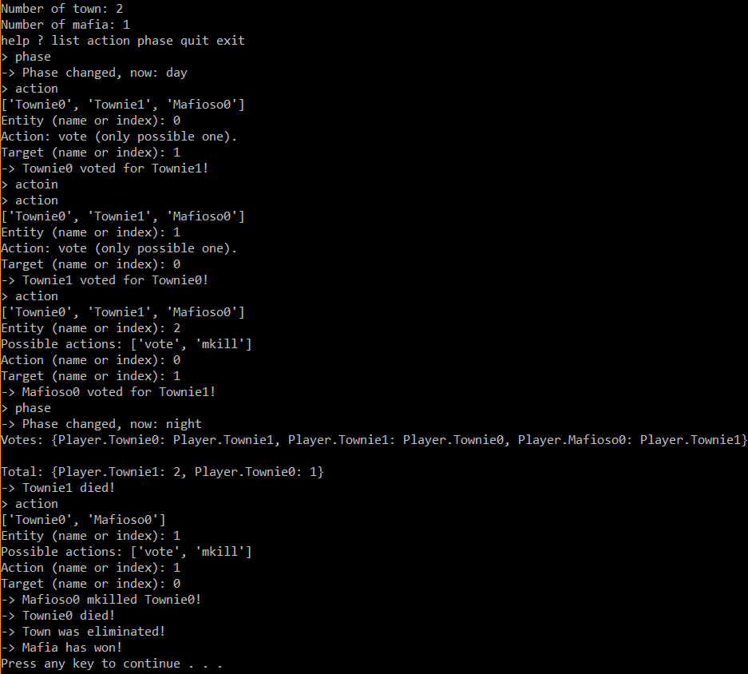

# Mafia Engine

Engine for Mafia-like games. Unsurprising, right?

This project is currently under construction.

## Current Development

The initial game engine is being built, along with a minimal set of abilities 
(later on, a large set of stock abilities will be available). Currently, the
example game runs approximately like this:

and everything about the game is hard-coded (no config yet).

## Motivation

Running a Mafia game, either in real life (IRL) or on a forum, takes a bit
of work. If that Mafia game is non-trivial, such as having a convoluted
set-up or being a BYOR (Bring Your Own Role), maintaining all players'
statuses, actions, votes, etc. becomes exponentially harder to keep track of.

By making a unified representation of a Mafia game, as well as an engine to
automatically calculate the state of your game-world, this difficulty gets
front-loaded into defining the game (i.e. before the game starts), so running
the game itself takes much less time and energy. It can also help reduce the 
amount of errors, increase consistency, and remove moderator bias.

Additionally, by defining games in a machine-readable way, the task of machine 
learning on Mafia games (e.g. predicting the mafia based on words, playstyle, 
etc.) becomes much easier, as all the data is there and doesn't need to be 
gathered by hand.

## Planned features

### Near-term:

- General definition of a mafia game (via config)
- Runnable GM tool with command-line UI
- Example ("vanilla"/"mountainous") mafia game
- State saving, with full history

### Long-term:

- Workable API
- Interaction with various mafia forums (starting with Bay12Games forums <3):
	- Automatic thread parsing
	- Helper for modding/GM-ing (player statistics, vote counts, etc.)
	- Searchable history, i.e. for machine learning tasks
- ???
- Profit!